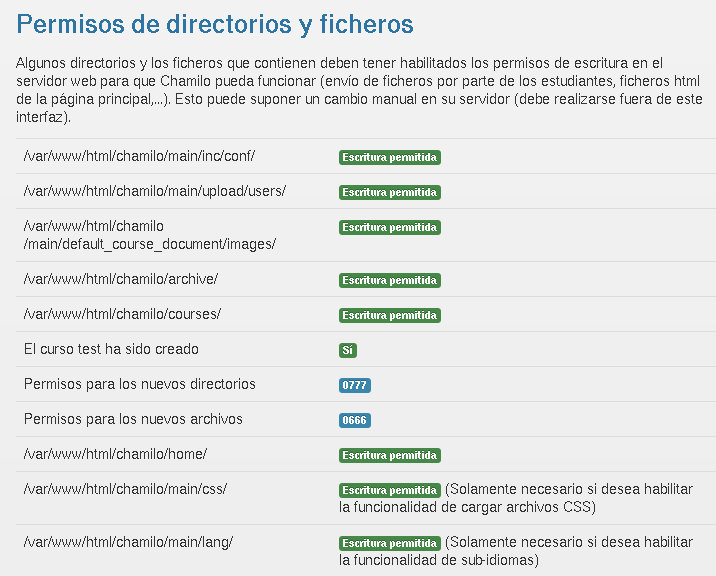
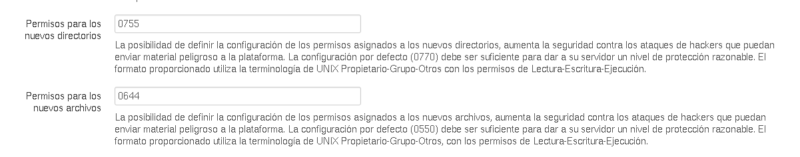

---------------

He instalado la pila LAMP

He instalado las siguientes dependencias de php:

```
apt-get install php-pear php5-gd php5-xsl curl libcurl3 libcurl3-dev php5-curl
```

Reiniciamos el servicio apache y cambiamos el propietario del directorio "chamilo" de manera recursiva.

```
root@servidor:/var/www/html# service apache2 restart
root@servidor:/var/www/html# chown -R www-data:www-data chamilo/
```

Durante la instalación nos saldrán diferentes recomendaciones(Timezone, máximo tamaño de subida de ficheros y de posts ...) por lo que debemos modificar el fichero de configuración php:

```
root@servidor:/var/www/html# nano /etc/php5/apache2/php.ini
``` 

Debemos descomentar la linea 

```
;date.timezone = "Europe/Madrid"
```

Y modificar las siguientes de tal forma:

```
post_max_size = 10M
upload_max_filesize = 10M
session.cookie_httponly = 1
```

A continuación he creado un usuario y una base de datos para "chamilo":

```
mysql> create user 'chamilo'@'localhost' identified by 'chamilo1234';

mysql> create database chamilo_db;

mysql> grant all privileges on chamilo_db.* to 'chamilo'@'localhost';

mysql> flush privileges;
```

Tras terminar la instalación obtenemos el siguiente mensaje de recomendación:

```
Aviso de seguridad: Para proteger su instalación, ponga la carpeta main/inc/conf/ en solo lectura (chmod -r 0555 bajo Linux) y borre completamente la carpeta main/install/.
```

Hacemos caso a este mensaje y ejecutamos dichas ordenes:

```
root@servidor:/var/www/html/chamilo# chown -R 0555  main/inc/conf/
root@servidor:/var/www/html/chamilo# rm -r main/install/
```

Durante la instalación observé que los permisos con los que se realizaban la instalación eran 0777 y 0666:



Por lo que una vez instalado he tenido que cambiar los permisos a 755 y 664 dentro del panel de administación:



Chamilo funciona correctamente en el entorno de desarrollo.

[Volver]

  [Volver]: ../index

